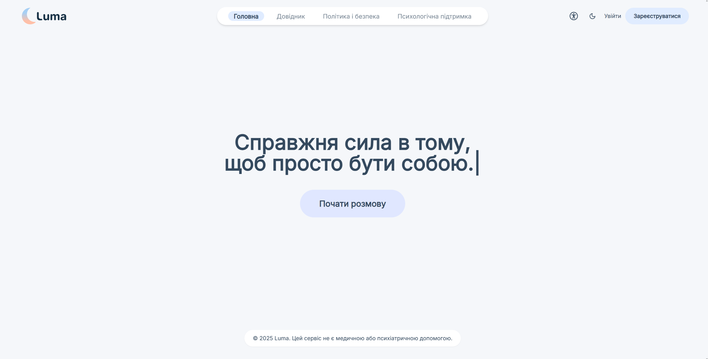
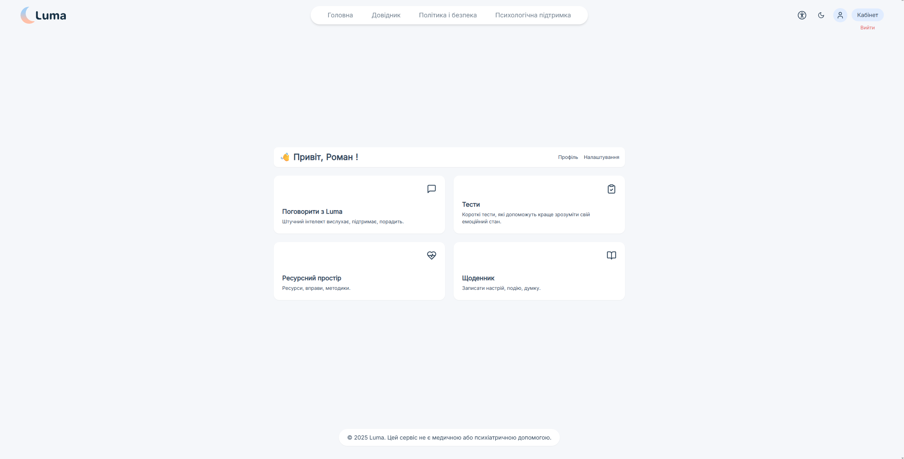
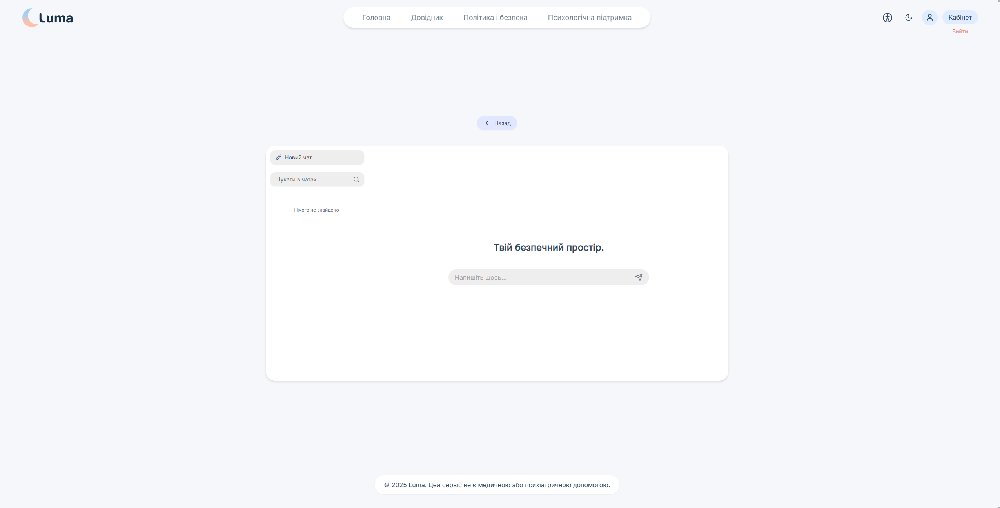
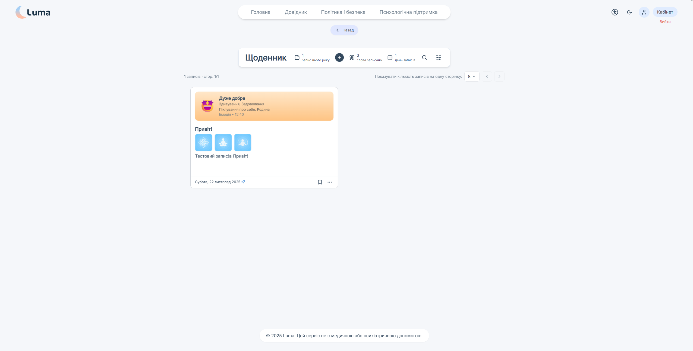
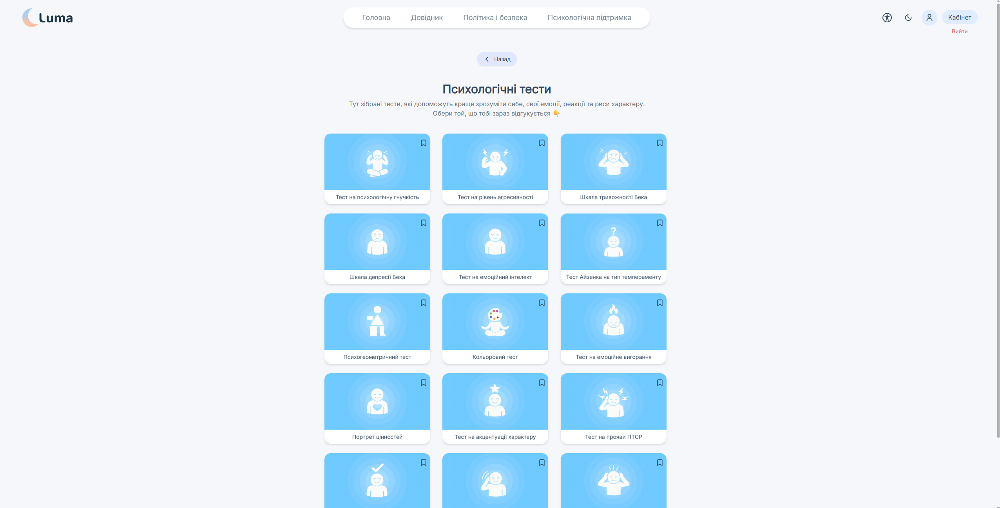
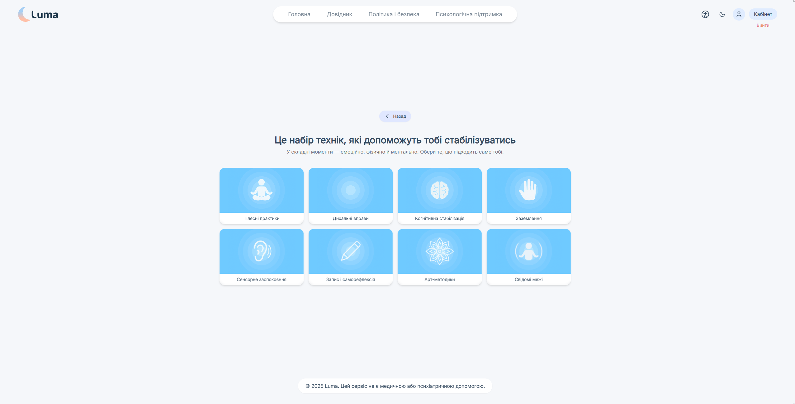
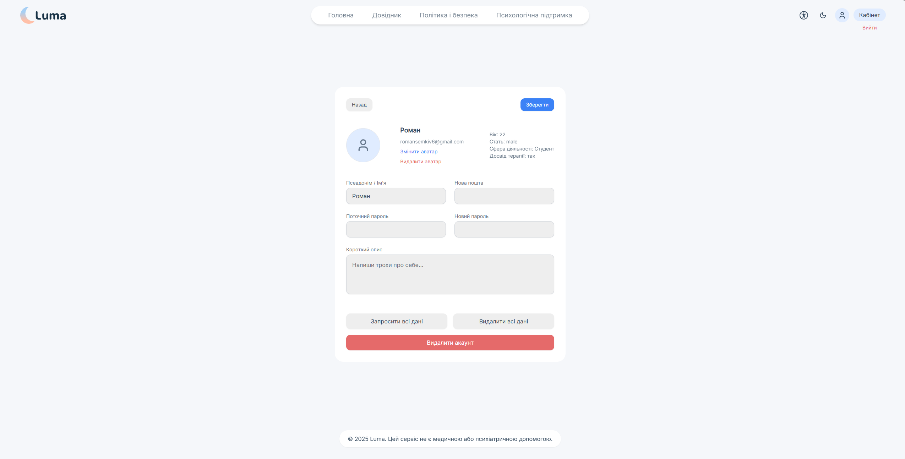
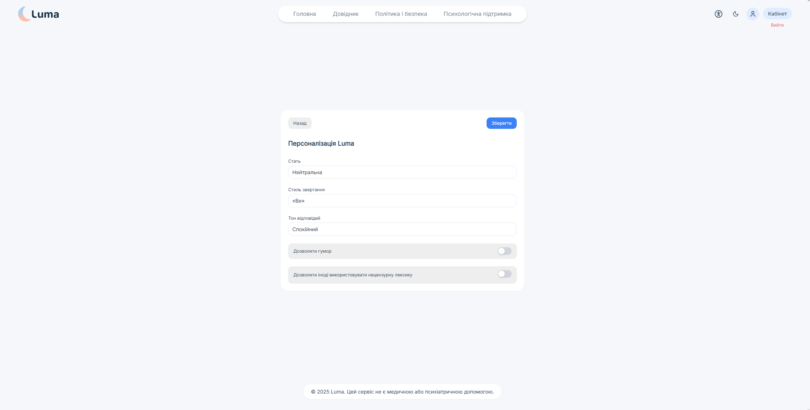
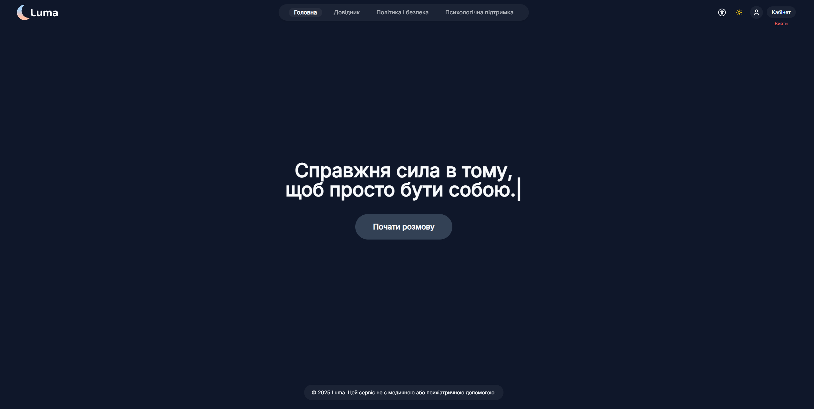

<p align="center">
  <a href="https://lumaproject.work">
    
  </a>
</p>

<h2 align="center">LUMA — веб-платформа емоційної саморефлексії</h2>

<p align="center">
  Магістерський проєкт з комп’ютерних наук · 2025
</p>

<p align="center">
  <a href="https://lumaproject.work">
    
  </a>
  
  
  
</p>

<p align="center">
  🔗 <b>Демо:</b> <a href="https://lumaproject.work">https://lumaproject.work</a>
</p>

## 1. Загальна інформація

**Назва проєкту**: Luma  
**Тип проєкту**: Веб-застосунок  
**Призначення**: Формування простору для емоційної саморефлексії, психологічних практик та взаємодії з ШІ-помічником.

<p align="center">
  Проєкт розроблений у межах магістерської кваліфікаційної роботи.
</p>

## 👤 Автор

- **ПІБ**: Семків Роман Васильович
- **Спеціальність**: Комп'ютерні науки
- **Заклад освіти**: Львівський національний університет ім. І. Франка
- **Керівник**: *Ненчук Тарас Миколайович*
- **Рік виконання**: 2025

---

## 📌 Технології

### Frontend
- React + Vite
- TailwindCSS
- Framer Motion

### Backend
- Node.js (Express)
- Firebase (Authentication, Firestore, Storage)

### Інші технології
- OpenAI API (аналіз емоційного стану)

---

## 🧠 Основний функціонал

✅ Реєстрація та авторизація користувача  
✅ Аналіз емоційного стану на основі введеного тексту  
✅ Ведення емоційного щоденника  
✅ Чат із ШІ-помічником (Luma)  
✅ Психологічні практики (дихання, grounding, тілесні, арт-терапія)  
✅ Тести психологічного стану  
✅ Система шифрування персональних даних  
✅ Експорт користувацьких даних у PDF

---

## 🧱 Структура проєкту

| Файл / Папка | Призначення |
|------------|-------------|
| `src/` | Основний код клієнтської частини |
| `server/` | Серверна логіка (Node.js + Express) |
| `firebase.js` | Конфігурація Firebase |
| `utils/secure.js` | Шифрування даних |
| `utils/exportPdf.js` | Експорт користувацьких даних |
| `components/` | React-компоненти |
| `pages/` | Основні сторінки застосунку |

---

## ▶️ Як запустити проєкт

### 1. Клонування репозиторію

Для отримання копії проєкту виконайте команду:

```bash
git clone <URL_до_репозиторію>
cd Luma
```

Якщо проєкт переданий у вигляді архіву – розпакуйте його та перейдіть у папку з проєктом.

---

### 2. Встановлення Node.js

Для запуску проєкту необхідно встановити Node.js  
версії **18.x LTS або новішої**.

Проєкт тестувався на версії: **Node.js 22.18.0**

Перевірка встановлення:

```bash
node -v
npm -v
```

---

### 3. Встановлення залежностей

Після клонування проєкту необхідно встановити всі залежності.

У кореневій папці проєкту виконайте:

```bash
npm install
```

Після цього встановіть залежності серверної частини:

```bash
cd server
npm install
cd ..
```

---

## 4. Налаштування змінних середовища (.env) і ключів шифрування

Для коректної роботи системи необхідно налаштувати змінні середовища  
та згенерувати ключ шифрування, який використовується  
як на клієнтській, так і на серверній частині.

---

### 4.1 Генерація ключа шифрування

У терміналі виконайте команду:

```bash
node -e "console.log(require('crypto').randomBytes(32).toString('hex'))"
```

Команда згенерує 256-бітний ключ у форматі HEX.

Приклад згенерованого ключа:

```
a7c9f2d98bbfb8e13ea1b98c0e7a3a5f1e4b6caa9d6c7e2c1b5f4e9a9c2a1b3
```

---

### 4.2 Налаштування `.env` у корені проєкту

У кореневій папці проєкту створіть або відкрийте файл `.env`  
і вставте:

```env
DATA_ENCRYPTION_KEY=your_encryption_key
VITE_ENCRYPTION_KEY=your_encryption_key
```

де `your_encryption_key` — згенерований вами ключ.

---

### 4.3 Налаштування `server/.env` та підключення OpenAI

У папці `server` відкрийте файл `.env` і додайте:

```env
OPENAI_API_KEY=Your_openai_key
DATA_ENCRYPTION_KEY=your_encryption_key
VITE_ENCRYPTION_KEY=your_encryption_key
```

---

### Де отримати `OPENAI_API_KEY`

1. Перейдіть на сайт платформи OpenAI:  
   https://platform.openai.com/api-keys
2. Увійдіть у свій обліковий запис або зареєструйтесь.
3. Створіть новий API-ключ.
4. Скопіюйте його і вставте замість `Your_openai_key` у `server/.env`.

---

### Баланс для роботи ШІ

Для роботи функцій ШІ (чат, аналіз емоцій)  
потрібен позитивний баланс на рахунку OpenAI.

✅ Рекомендований мінімальний баланс: **від 5 USD**

Без балансу:
- OpenAI API не повертає відповіді
- модулі ШІ у застосунку Luma не працюватимуть

---

### ⚠️ ВАЖЛИВО

- Значення `DATA_ENCRYPTION_KEY` повинно бути **однаковим** у:
    - `.env` (корінь проєкту)
    - `server/.env`

- Значення `VITE_ENCRYPTION_KEY` повинно бути **ідентичним** до `DATA_ENCRYPTION_KEY`

- Якщо ключі різні — система шифрування працювати не буде.

---

## 🔥 Підключення Firebase (Database, Storage, Auth) для Luma

Цей розділ описує повне підключення Firebase до проєкту **Luma**  
(база даних, storage, авторизація, сервісний акаунт, індекси).

---

### 1. Створення Firebase-проєкту

1. Перейдіть на:  
   https://console.firebase.google.com

2. Натисніть **Get started by setting up a Firebase project**

3. Дайте будь-яку назву проєкту  
   (наприклад: `luma-project`)

4. На етапі налаштувань:
    - Google Analytics — **вимкнути**
    - Firebase AI — **вимкнути**

5. У **Project Overview**:
    - натисніть **Add app**
    - оберіть **Web (</>)**

6. Дайте ім'я апці (наприклад: `Luma Web`)

7. **Hosting не вмикати** (галочку не ставити)

8. Firebase надасть вам конфіг типу:

```js
const firebaseConfig = {
  apiKey: "...",
  authDomain: "...",
  projectId: "...",
  storageBucket: "...",
  messagingSenderId: "...",
  appId: "..."
};
```

9. Скопіюйте значення від `apiKey` до `appId`  
   та вставте у файл:

```
src/firebase.js
```

у цей об'єкт:

```js
const firebaseConfig = {
  apiKey: "YOUR_API_KEY",
  authDomain: "YOUR_AUTH_DOMAIN",
  projectId: "YOUR_PROJECT_ID",
  storageBucket: "YOUR_STORAGE_BUCKET",
  messagingSenderId: "YOUR_SENDER_ID",
  appId: "YOUR_APP_ID"
};
```

---

### 2. Налаштування Firestore Database

1. Перейдіть:  
   **Build → Firestore Database**

2. Натисніть **Create database**

3. Оберіть:
    - Standard edition
    - Region: `us-west1`
    - Mode: **Start in test mode**
> ⚠️ **Примітка:** Режим `test mode` використовується лише для локального запуску  
> або демонстрації проєкту на кафедрі.  
> Для продакшн-версії передбачено переведення на production rules.

4. Перейдіть у вкладку **Rules** і вставте:

```txt
rules_version = '2';
service cloud.firestore {
  match /databases/{database}/documents {

    match /users/{uid}/journalEntries/{docId} {
      allow read, write: if request.auth != null && request.auth.uid == uid;
    }

    match /users/{uid}/chats/{chatId} {
      allow read, write: if request.auth != null && request.auth.uid == uid;
    }

    match /users/{uid}/chats/{chatId}/messages/{msgId} {
      allow read, write: if request.auth != null && request.auth.uid == uid;
    }

    match /users/{uid} {
      allow read, write: if request.auth != null && request.auth.uid == uid;
    }

    match /users/{uid}/config/{docId} {
      allow read, write: if request.auth != null && request.auth.uid == uid;
    }

    match /users/{uid}/memory/{docId} {
      allow read, write: if request.auth != null && request.auth.uid == uid;
    }

    match /users/{uid}/reflections/{docId} {
      allow read, write: if request.auth != null && request.auth.uid == uid;
    }
  }
}
```

---

### 3. Налаштування Firebase Storage

1. Перейдіть у:  
   **Build → Storage**

2. Якщо Firebase просить прив'язати картку:
    - прив'яжіть (кошти списуватись не будуть)
    - у вікні білінгу натисніть **Skip**

3. Натисніть **Set up default bucket**

4. Оберіть регіон:
   ```
   us-west1
   ```

   Якщо не підтримує — спробуйте:
   ```
   us-west1
   us-central1
   us-east1
   ```

5. Оберіть **Start in test mode**
> ⚠️ **Примітка:** Режим `test mode` використовується лише для локального запуску  
> або демонстрації проєкту на кафедрі.  
> Для продакшн-версії передбачено переведення на production rules.

6. У вкладці **Rules** вставте:

```txt
rules_version = '2';
service firebase.storage {
  match /b/{bucket}/o {

    match /avatars/{userId} {
      allow read, write: if request.auth != null && request.auth.uid == userId;
    }

    match /journal/{userId}/{allPaths=**} {
      allow read, write: if request.auth != null && request.auth.uid == userId;
    }

    match /{allPaths=**} {
      allow read, write: if false;
    }
  }
}
```

---

### 4. Authentication

1. Перейдіть у:  
   **Build → Authentication**

2. Натисніть **Get started**

3. У вкладці **Sign-in method** увімкніть:
    - `Email/Password`

4. Натисніть **Save**

---

### 5. Підключення Service Account

1. У Firebase Console відкрийте:  
   **Project Overview → ⚙ Project Settings → Service Accounts**

2. Натисніть:  
   **Generate new private key**

3. Файл буде типу:
```
something-something-firebase-adminsdk-xxxxx.json
```

4. Перейменуйте на:

```
serviceAccountKey.json
```

5. Покладіть у:

```
server/serviceAccountKey.json
```

---

### 6. Додавання Project ID у Firebase CLI

1. У **Project Settings** знайдіть ваш:
```
Project ID
```

2. Відкрийте файл:

```
.firebaserc
```

3. Замініть на свій Project ID:

```json
{
  "projects": {
    "default": "your_project_id_here"
  }
}
```

---

### 7. Виправлення Firebase Index Error

Якщо в консолі з'являється помилка:

```
FirebaseError: The query requires an index
```

1. Перейдіть за лінком, який дасть помилка.
2. Натисніть **Create / Save index**
3. Дочекайтесь, поки статус **Creating** зникне.

👉 Повторіть для кожної аналогічної помилки.

---

✅ Firebase повністю готовий до роботи з Luma.

---

## ▶️ Запуск проєкту

Проєкт складається з двох частин:  
**клієнтська** та **серверна**.

Перед запуском переконайтесь, що всі залежності встановлені  
(див. розділ *Встановлення залежностей*).

---

### 1. Запуск серверної частини

Перейдіть у папку `server`:

```bash
cd server
```

Далі виконайте команду:

```bash
node server.js
```

Сервер буде запущений локально  
(за замовчуванням: `http://localhost:5000`).

---

### 2. Запуск клієнтської частини

Відкрийте **нову вкладку терміналу**  
та поверніться в корінь проєкту:

```bash
cd ..
```

Запустіть клієнтську частину командою:

```bash
npm run dev
```

Проєкт буде доступний у браузері за адресою:

```txt
http://localhost:5173
```

---

✅ Після запуску **двох частин** проєкт повністю готовий до роботи.

## 🧑‍💻 Інструкція користування Luma

1. Перейдіть на сайт або відкрийте локальний сервер.
2. Зареєструйтесь через Email.
3. На головній сторінці введіть текст у поле аналізу емоцій.
4. Перейдіть у розділи:
    - 📘 Чат з Luma
    - 📓 Щоденник
    - 🧠 Тести
    - 🧘 Ресурсний простір
5. Для збереження даних використовується особистий обліковий запис.
6. Дані користувача шифруються та передаються через Firebase.

## 🏗️ Архітектурна схема

Luma складається з двох основних частин:

- Frontend (React + Vite)
- Backend (Node.js + Express)

📡 Взаємодія:
- Frontend → Firebase (Auth, Firestore, Storage)
- Frontend → Backend (OpenAI API проксі)
- Backend → OpenAI API
- Backend → Firebase Admin

Сервер виконує роль:
- посередника з OpenAI
- місця для обробки чутливих даних
- централізації шифрування

## 🧯 Типові проблеми при запуску

| Проблема | Рішення |
|--------|---------|
| `openai is not defined` | Перевірити встановлення пакету `openai` та наявність `OPENAI_API_KEY` у `server/.env` |
| Не запускається сервер | Перевірити Node.js версії >= 22 |
| Помилка Firebase auth | Перевірити дані в `firebase.js` |
| Дані не шифруються | Перевірити однаковість ключів `DATA_ENCRYPTION_KEY` |
| Firestore index error | Створити індекс за лінком з помилки |

## 📸 Інтерфейс застосунку Luma

### 🏠 Головна сторінка
<p align="center">
  
</p>

---

### 👤 Особистий кабінет
<p align="center">
  
</p>

---

### 💬 Чат з Luma
<p align="center">
  
  
</p>

---

### 📔 Емоційний щоденник
<p align="center">
  
</p>

---

### 🧪 Психологічні тести
<p align="center">
  
</p>

---

### 🌿 Ресурсний простір
<p align="center">
  
</p>

---

### 👤 Профіль користувача
<p align="center">
  
</p>

---

### ⚙️ Налаштування
<p align="center">
  
</p>

---

### 🌙 Темна тема
<p align="center">
  
</p>

## 🧾 Використані джерела / література

### Технології та офіційна документація
1. React Documentation — https://react.dev
2. React Router — https://reactrouter.com
3. Vite — https://vitejs.dev
4. TailwindCSS — https://tailwindcss.com
5. Framer Motion — https://www.framer.com/motion
6. Firebase (Auth, Firestore, Storage) — https://firebase.google.com/docs
7. OpenAI API — https://platform.openai.com/docs
8. Node.js — https://nodejs.org/en/docs
9. Express.js — https://expressjs.com
10. Three.js — https://threejs.org/docs
11. @react-three/fiber — https://docs.pmnd.rs/react-three-fiber
12. @react-three/drei — https://github.com/pmndrs/drei
13. Tiptap Editor — https://tiptap.dev
14. date-fns — https://date-fns.org
15. html2canvas — https://html2canvas.hertzen.com
16. jsPDF — https://github.com/parallax/jsPDF
17. pdfmake — https://pdfmake.github.io/docs

### Допоміжні інструменти
1. Lucide React Icons — https://lucide.dev
2. React Joyride (онбординг) — https://react-joyride.com
3. Yet Another React Lightbox — https://yet-another-react-lightbox.com
4. Twemoji — https://twemoji.twitter.com
5. React Markdown — https://github.com/remarkjs/react-markdown

### Загальні ресурси, використані під час розробки
1. MDN Web Docs — https://developer.mozilla.org
2. StackOverflow — https://stackoverflow.com
3. W3C Web Standards — https://www.w3.org
